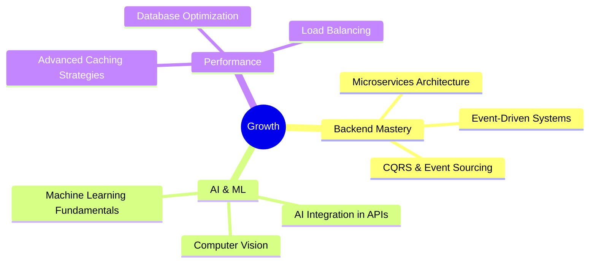

<div align="center">

# 👨‍💻 Backend Architect & Systems Engineer

### Crafting High-Performance Systems with ASP.NET Core, Python, Go & C++


[](https://linkedin.com)
[](https://portfolio.com)
[](mailto:your@email.com)

</div>

---

## 🎯 What Sets Me Apart

```typescript
const engineer = {
    expertise: "Backend-focused Full-Stack Development",
    mindset: "Polyglot Engineer: High-level APIs ↔️ Low-level System Programming",
    
    proven_track_record: {
        users_served: "500+",
        uptime: "99.9%",
        requests_per_second: "1000+",
        avg_response_time: "<50ms"
    },
    
    approach: ["Security-First", "Performance-Driven", "Clean Architecture"]
};
```

<div align="center">

### 📊 Production Metrics

| Metric | Achievement |
|--------|-------------|
| 🚀 **Requests/sec** | 1,000+ handled |
| ⚡ **Uptime** | 99.9% maintained |
| 👥 **Active Users** | 500+ served |
| 📈 **API Response** | <50ms average |

</div>

---

## 💻 Tech Stack

<div align="center">

### Core Languages & Frameworks


### Databases & Data


### DevOps & Tools


</div>

---

## 🚀 Expertise Domains

<table>
<tr>
<td width="50%" valign="top">

### ⚡ Backend & API Development

- **ASP.NET Core (C#)**: High-performance APIs & WPF desktop apps
- **Python FastAPI**: Modern async APIs with Pydantic validation
- **Go (Golang)**: Lightweight, concurrent microservices
- **Advanced C++**: System-level programming & optimization

</td>
<td width="50%" valign="top">

### 🏗️ Architecture & Performance

- **Async/Parallel Programming**: Expert in `asyncio` (Python) and multithreading (C#)
- **System Design**: Clean Architecture & Design Patterns
- **Concurrency**: OCC implementation, race condition prevention
- **Performance**: Sub-50ms response times, 1000+ req/sec

</td>
</tr>
<tr>
<td width="50%" valign="top">

### 🗄️ Databases & Data Engineering

- **SQL**: PostgreSQL, MS SQL Server (optimization & design)
- **NoSQL**: MongoDB (motor, aggregations, indexing)
- **Performance**: Connection pooling, query optimization
- **Data Integrity**: OCC, transaction management

</td>
<td width="50%" valign="top">

### 🔒 Security & Authentication

- **JWT (JOSE)**: Full authentication lifecycle implementation
- **OAuth 2.0**: Google Login integration
- **Encryption**: bcrypt password hashing, SHA-256 integrity
- **Best Practices**: OWASP principles, secure API design

</td>
</tr>
</table>

---

## 🌟 Featured Projects

<div align="center">

### 🎭 Velora - Social Media Backend Platform


</div>

**A production-ready social media backend handling real-world traffic at scale**

```python
# Performance Highlights
{
    "requests_per_second": 1000+,
    "uptime": "99.9%",
    "active_users": 500+,
    "response_time": "<50ms",
    "architecture": "Async/Non-blocking"
}
```

**🔥 Key Features:**
- ⚡ **Blazing Fast**: Handles 1000+ concurrent requests/sec with async architecture
- 🔐 **Enterprise Security**: Full JWT + OAuth 2.0 (Google Login) implementation
- 📊 **Advanced Database**: MongoDB aggregation pipelines, optimized indexing
- 🛠️ **Production Ready**: Custom middleware, comprehensive error handling
- 🎯 **Real-World Scale**: Serving 500+ active users with 99.9% uptime

**Technical Deep Dive:**
- Advanced `asyncio` patterns including `run_in_executor` for CPU-bound operations (bcrypt)
- Motor async MongoDB driver with connection pooling optimization
- JWT refresh token rotation and secure session management
- Custom FastAPI middleware for request validation and logging

---

<div align="center">

### 🖥️ SRC App - System Resource Monitor


</div>

**Real-time system monitoring with low-level Windows API integration**

```csharp
// System Performance
{
    "refresh_rate": "<100ms",
    "platform": ".NET 9 / WPF",
    "api_level": "WMI + PerformanceCounter",
    "threading": "Advanced Parallel Computing"
}
```

**🔥 Key Features:**
- 📈 **Real-Time Monitoring**: Sub-100ms refresh rate for system metrics
- 🔧 **Low-Level APIs**: Direct WMI and PerformanceCounter integration
- ⚡ **Optimized Threading**: `Dispatcher.Invoke` for UI updates, `Parallel.For` for data processing
- 🎨 **Modern UI**: Responsive WPF interface with data visualization
- 💻 **System Integration**: Deep Windows OS integration for accurate metrics

**Technical Deep Dive:**
- Advanced multithreading with `Task.Run` and proper UI thread marshaling
- Performance Counter optimization for minimal system overhead
- WMI queries for hardware information and system stats
- Parallel processing for multi-core CPU utilization analysis

---

<div align="center">

### 🗃️ YaraDB - In-Memory JSON Database


</div>

**Lightweight in-memory database with enterprise-grade reliability**

```json
{
    "architecture": "In-Memory JSON Storage",
    "consistency": "99.99%",
    "concurrency": "Optimistic Concurrency Control (OCC)",
    "integrity": "SHA-256 checksums"
}
```

**🔥 Key Features:**
- 🎯 **OCC Implementation**: Prevents race conditions in concurrent environments
- 🔐 **Data Integrity**: SHA-256 checksums for corruption detection
- 🏗️ **Design Patterns**: Strategy Pattern for pluggable storage backends
- 🐳 **DevOps Ready**: Fully containerized with Docker
- ⚡ **Performance**: In-memory operations with persistence layer

**Technical Deep Dive:**
- Custom Optimistic Concurrency Control implementation
- Version-based conflict detection and resolution
- Atomic write operations with rollback capability
- Strategy Pattern for extensible storage backends (JSON, Binary, etc.)

---

## 📚 What I'm Learning & Exploring

<div align="center">



</div>

---

## 🎓 Core Competencies

<div align="center">

| Domain | Skills |
|--------|--------|
| **Languages** | C#, Python, Go, C++, SQL, JavaScript/TypeScript |
| **Frameworks** | ASP.NET Core, FastAPI, WPF, React |
| **Databases** | PostgreSQL, MongoDB, SQL Server, Supabase, NeonDB |
| **Architecture** | Clean Architecture, Microservices, Design Patterns |
| **DevOps** | Docker, Docker Compose, CI/CD, Git |
| **Security** | JWT, OAuth 2.0, bcrypt, OWASP practices |
| **Performance** | Async/Await, Multithreading, Caching, Optimization |
| **Soft Skills** | Problem Solving, System Design, Code Review, Mentoring |

</div>

---

## 💡 Engineering Philosophy

> **"Build systems that are secure by design, performant by default, and maintainable by nature."**

```python
my_approach = {
    "code_quality": [
        "Clean, readable, and self-documenting code",
        "Comprehensive error handling and logging",
        "Extensive testing and validation"
    ],
    "architecture": [
        "Scalability from day one",
        "Security as a foundational requirement",
        "Performance optimization at every layer"
    ],
    "collaboration": [
        "Clear documentation and API contracts",
        "Code reviews and knowledge sharing",
        "Continuous learning and improvement"
    ]
}
```

---

## 📫 Let's Connect

<div align="center">

**Open to freelance projects, collaborations, and exciting opportunities!**

[](https://linkedin.com)
[](https://portfolio.com)
[](mailto:your@email.com)
[](https://fiverr.com)

---

### ⚡ Fun Fact

*I can debug a race condition in a distributed system at 3 AM and still make it look elegant* 🚀

---


**💼 Available for freelance work** • **🌍 Remote-friendly** • **🕐 UTC+2**

</div>
