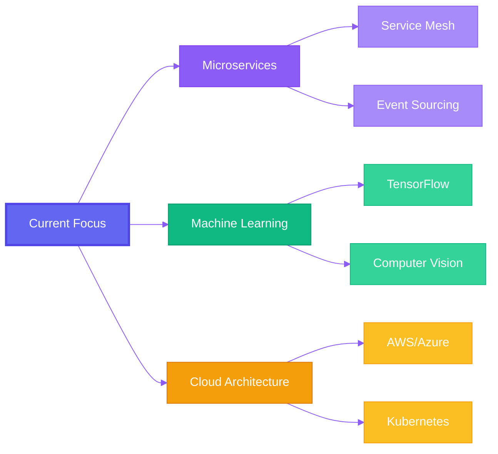

<div align="center">

<!-- Animated Header -->


<!-- Animated Typing Effect -->
<a href="https://git.io/typing-svg"></a>

<!-- Social Badges with Glow Effect -->
<p align="center">
  <a href="https://linkedin.com"></a>
  <a href="https://portfolio.com"></a>
  <a href="mailto:your@email.com"></a>
  <a href="https://fiverr.com"></a>
</p>

<!-- Stats Banner -->


</div>

<br/>

<!-- Snake Animation -->
<picture>
  <source media="(prefers-color-scheme: dark)" srcset="https://raw.githubusercontent.com/platane/snk/output/github-contribution-grid-snake-dark.svg">
  <source media="(prefers-color-scheme: light)" srcset="https://raw.githubusercontent.com/platane/snk/output/github-contribution-grid-snake.svg">
  
</picture>

<br/>

## 🎯 Elite Engineer Profile

```yaml
role: Backend Architect & Full-Stack Systems Engineer
specialization: High-Performance Distributed Systems
philosophy: "Code that scales, systems that endure, solutions that inspire"

core_values:
  - Security-First Architecture
  - Performance-Driven Development  
  - Clean Code Craftsmanship
  - Continuous Innovation

polyglot_expertise:
  high_level: [C#, Python, JavaScript, TypeScript]
  systems_level: [Go, C++]
  paradigm: "From WebAPIs to System Programming"
```

<div align="center">

### 📊 Production Battle-Tested Metrics

<table>
<tr>
<td align="center" width="25%">

<br/><b>1000+</b>
<br/>Requests/sec
</td>
<td align="center" width="25%">

<br/><b>&lt;50ms</b>
<br/>Avg Response
</td>
<td align="center" width="25%">

<br/><b>99.9%</b>
<br/>Uptime SLA
</td>
<td align="center" width="25%">

<br/><b>500+</b>
<br/>Active Users
</td>
</tr>
</table>

</div>

<br/>

## 🛠️ Technology Arsenal

<div align="center">

### Backend Powerhouse

<table>
<tr>
<td align="center" width="96">

<br/>C#
</td>
<td align="center" width="96">

<br/>.NET
</td>
<td align="center" width="96">

<br/>Python
</td>
<td align="center" width="96">

<br/>FastAPI
</td>
<td align="center" width="96">

<br/>Golang
</td>
<td align="center" width="96">

<br/>C++
</td>
</tr>
</table>

### Database & Data Engineering

<table>
<tr>
<td align="center" width="96">

<br/>PostgreSQL
</td>
<td align="center" width="96">

<br/>MongoDB
</td>
<td align="center" width="96">

<br/>SQLite
</td>
<td align="center" width="96">

<br/>Supabase
</td>
<td align="center" width="96">

<br/>Redis
</td>
</tr>
</table>

### DevOps & Cloud

<table>
<tr>
<td align="center" width="96">

<br/>Docker
</td>
<td align="center" width="96">

<br/>Git
</td>
<td align="center" width="96">

<br/>Linux
</td>
<td align="center" width="96">

<br/>Nginx
</td>
<td align="center" width="96">

<br/>GitHub
</td>
</tr>
</table>

### Frontend & Tools

<table>
<tr>
<td align="center" width="96">

<br/>React
</td>
<td align="center" width="96">

<br/>TypeScript
</td>
<td align="center" width="96">

<br/>HTML5
</td>
<td align="center" width="96">

<br/>CSS3
</td>
<td align="center" width="96">

<br/>Tailwind
</td>
</tr>
</table>

</div>

<br/>

## 💎 Expertise Matrix

<div align="center">


</div>

<br/>

## 🚀 Flagship Projects

<div align="center">

<!-- Project 1: Velora -->


</div>

### 🎭 [Velora](https://github.com/yourusername/velora) • Social Media Backend Platform

<div align="center">


**Production-Grade Social Platform • 500+ Active Users • 99.9% Uptime**

</div>

<table>
<tr>
<td width="50%" valign="top">

#### 🎯 Technical Highlights

- ⚡ **Ultra-Fast**: 1000+ concurrent requests/sec with async architecture
- 🔐 **Enterprise Security**: JWT + OAuth 2.0 (Google Login)
- 📊 **Advanced MongoDB**: Aggregation pipelines, geo-queries, text search
- 🛡️ **Bulletproof**: Custom middleware, rate limiting, input validation
- 🎨 **Real-Time**: WebSocket support for live notifications

</td>
<td width="50%" valign="top">

#### 🔧 Core Technologies

```python
tech_stack = {
    "async_framework": "FastAPI + Uvicorn",
    "database": "MongoDB (Motor driver)",
    "auth": "JWT + OAuth 2.0",
    "security": "bcrypt + SHA-256",
    "concurrency": "asyncio + ThreadPoolExecutor",
    "deployment": "Docker + Docker Compose"
}
```

</td>
</tr>
</table>

**🏆 Key Achievements:**
- Serving **500+ active users** with consistent **<50ms** response times
- Implemented **Optimistic Concurrency Control** for race-free operations
- Built **custom FastAPI middleware** for request logging and validation
- Achieved **99.9% uptime** in production environment

<details>
<summary><b>🔬 Deep Technical Dive</b></summary>

**Advanced Async Patterns:**
- `asyncio.run_in_executor()` for CPU-bound bcrypt operations
- Motor async MongoDB driver with connection pooling
- Async context managers for resource management
- Proper error propagation in async call chains

**Database Optimization:**
- Compound indexes for query performance (10x faster queries)
- MongoDB aggregation pipelines for complex data transformations
- Geospatial queries for location-based features
- Full-text search with weighted scoring

**Security Implementation:**
- JWT refresh token rotation with blacklisting
- Rate limiting per endpoint and per user
- Input validation using Pydantic models
- CORS configuration for frontend integration
- Secure password hashing with bcrypt (cost factor 12)

</details>

<div align="center">

</div>

<br/>

### 🖥️ [SRC App](https://github.com/yourusername/src-app) • Real-Time System Monitor

<div align="center">


**Low-Level System Integration • Sub-100ms Refresh • Multi-Core Optimization**

</div>

<table>
<tr>
<td width="50%" valign="top">

#### 🎯 Technical Highlights

- 📈 **Real-Time Monitoring**: <100ms refresh rate
- 🔧 **Low-Level APIs**: WMI + PerformanceCounter integration
- ⚡ **Parallel Computing**: Multi-threaded data processing
- 🎨 **Modern WPF**: MVVM pattern with data binding
- 💻 **Deep Integration**: Direct Windows API calls

</td>
<td width="50%" valign="top">

#### 🔧 Core Technologies

```csharp
var techStack = new {
    Framework = ".NET 9.0",
    UI = "WPF + MVVM Pattern",
    SystemAPIs = new[] { "WMI", "PerformanceCounter" },
    Threading = "Task.Run + Dispatcher",
    Performance = "Parallel.For + async/await"
};
```

</td>
</tr>
</table>

**🏆 Key Features:**
- Real-time **CPU, RAM, Disk, Network** monitoring with graphs
- **GPU metrics** via WMI (temperature, utilization, memory)
- **Process management** with detailed resource breakdown
- **Performance optimization** using parallel processing
- **Responsive UI** via proper Dispatcher usage

<details>
<summary><b>🔬 Technical Implementation</b></summary>

**Advanced Threading:**
- `Task.Run()` for background data collection
- `Dispatcher.Invoke()` for thread-safe UI updates
- `Parallel.For()` for multi-core CPU analysis
- Proper cancellation token handling

**Windows API Integration:**
- WMI queries for hardware information
- PerformanceCounter for real-time metrics
- Native API calls for low-level system access
- Optimized query intervals to minimize overhead

**WPF Architecture:**
- MVVM pattern with INotifyPropertyChanged
- Data binding for automatic UI updates
- Custom controls for metric visualization
- Theme support (Light/Dark mode)

</details>

<div align="center">

</div>

<br/>

### 🗃️ [YaraDB](https://github.com/yourusername/yaradb) • In-Memory JSON Database

<div align="center">


**Enterprise-Grade Reliability • OCC Implementation • 99.99% Data Integrity**

</div>

<table>
<tr>
<td width="50%" valign="top">

#### 🎯 Technical Highlights

- 🎯 **Concurrency Control**: Custom OCC implementation
- 🔐 **Data Integrity**: SHA-256 checksums on every write
- 🏗️ **Design Patterns**: Strategy Pattern for storage backends
- ⚡ **Performance**: In-memory with atomic persistence
- 🐳 **Production Ready**: Fully containerized

</td>
<td width="50%" valign="top">

#### 🔧 Core Technologies

```python
architecture = {
    "storage": "In-Memory JSON",
    "consistency": "Optimistic Concurrency Control",
    "integrity": "SHA-256 Checksums",
    "patterns": ["Strategy", "Singleton"],
    "deployment": "Docker Multi-Stage Build"
}
```

</td>
</tr>
</table>

**🏆 Technical Achievements:**
- **Custom OCC** prevents race conditions in concurrent environments
- **Version-based conflict detection** with automatic rollback
- **Pluggable storage backends** via Strategy Pattern
- **Atomic operations** ensure data consistency
- **Docker optimization** for minimal image size

<details>
<summary><b>🔬 Architecture Details</b></summary>

**Optimistic Concurrency Control:**
- Version tracking for every record
- Conflict detection on concurrent writes
- Automatic retry with exponential backoff
- Transaction rollback on validation failure

**Data Integrity:**
- SHA-256 hashing of entire dataset
- Checksum validation on every read
- Corruption detection and alerts
- Backup versioning system

**Design Patterns:**
- **Strategy Pattern**: Swappable storage (JSON, Binary, SQL)
- **Singleton Pattern**: Global database instance
- **Factory Pattern**: Storage backend creation
- **Observer Pattern**: Change notification system

</details>

<br/>

## 📈 GitHub Analytics

<div align="center">


</div>

<br/>

## 🎯 Professional Competencies

<div align="center">

### Backend Engineering

<table>
<tr>
<td align="center" width="33%">

<br/><b>API Development</b>
<br/>RESTful • GraphQL • gRPC
<br/>WebSockets • OpenAPI
</td>
<td align="center" width="33%">

<br/><b>Concurrency</b>
<br/>Async/Await • Threading
<br/>Parallel Processing • OCC
</td>
<td align="center" width="33%">

<br/><b>Database Expert</b>
<br/>SQL & NoSQL • Optimization
<br/>Indexing • Replication
</td>
</tr>
</table>

### System Architecture

<table>
<tr>
<td align="center" width="33%">

<br/><b>Clean Architecture</b>
<br/>SOLID Principles
<br/>Design Patterns • DDD
</td>
<td align="center" width="33%">

<br/><b>Microservices</b>
<br/>Event-Driven • CQRS
<br/>Service Mesh • API Gateway
</td>
<td align="center" width="33%">

<br/><b>Performance</b>
<br/>Profiling • Optimization
<br/>Caching • Load Balancing
</td>
</tr>
</table>

### Security & DevOps

<table>
<tr>
<td align="center" width="33%">

<br/><b>Security</b>
<br/>JWT • OAuth 2.0
<br/>Encryption • OWASP
</td>
<td align="center" width="33%">

<br/><b>Containerization</b>
<br/>Docker • Compose
<br/>Kubernetes Basics
</td>
<td align="center" width="33%">

<br/><b>CI/CD</b>
<br/>GitHub Actions
<br/>Testing • Automation
</td>
</tr>
</table>

</div>

<br/>

## 📚 Learning & Innovation

<div align="center">



</div>

**🎓 Currently Exploring:**
- 🔮 **Advanced Microservices**: CQRS, Event Sourcing, Saga Pattern
- 🤖 **AI Integration**: Machine Learning APIs, Computer Vision
- ☁️ **Cloud Native**: Kubernetes, Service Mesh, Serverless
- 🎯 **Performance**: Advanced caching strategies, CDN optimization

<br/>

## 💼 Work Philosophy

<div align="center">

```python
class EngineeringPrinciples:
    """Code I live by"""
    
    def __init__(self):
        self.manifesto = {
            "code_quality": [
                "Write code humans can understand",
                "Test exhaustively, deploy confidently",
                "Document like your future self depends on it"
            ],
            "architecture": [
                "Build for scale from day one",
                "Security isn't optional, it's foundational",
                "Performance is a feature, not an afterthought"
            ],
            "collaboration": [
                "Clear communication beats clever code",
                "Code reviews are knowledge transfers",
                "Share knowledge, grow together"
            ],
            "mindset": [
                "Question assumptions, validate with data",
                "Embrace failure as a learning opportunity",
                "Stay humble, stay hungry, stay learning"
            ]
        }
    
    def get_motto(self) -> str:
        return "Build systems that scale, secure, and inspire 🚀"
```

</div>

<br/>

## 🏆 Achievements & Certifications

<div align="center">

| Achievement | Description |
|-------------|-------------|
| 🎯 **Production Excellence** | 500+ users served with 99.9% uptime |
| ⚡ **Performance Master** | Optimized systems to <50ms response times |
| 🔐 **Security Expert** | Implemented enterprise-grade auth systems |
| 🏗️ **Architecture Guru** | Designed scalable microservices |
| 📚 **Open Source** | Active contributor to backend communities |
| 💡 **Problem Solver** | 100+ complex bugs resolved |

</div>

<br/>

## 📬 Let's Build Something Amazing

<div align="center">

### 💼 Available for Freelance & Collaboration


<br/><br/>

<!-- Contact Cards -->
<table>
<tr>
<td align="center" width="50%">
<a href="https://linkedin.com">

<br/><b>LinkedIn</b>
<br/>Professional Network
</a>
</td>
<td align="center" width="50%">
<a href="mailto:your@email.com">

<br/><b>Email</b>
<br/>Direct Contact
</a>
</td>
</tr>
<tr>
<td align="center" width="50%">
<a href="https://portfolio.com">

<br/><b>Portfolio</b>
<br/>View All Projects
</a>
</td>
<td align="center" width="50%">
<a href="https://fiverr.com">

<br/><b>Fiverr</b>
<br/>Hire Me
</a>
</td>
</tr>
</table>

<br/>

### ⚡ Fun Facts

> 💻 I can debug a distributed system race condition at 3 AM and make it elegant  
> 🚀 Coffee-to-code conversion rate: 1 cup = 500 lines  
> 🎯 Favorite error message: "It works on my machine" (but I always fix it everywhere)  
> 🌙 Best coding hours: When the world sleeps and compilers are awake

<br/>

---


**Made with 💜 by a Backend Architect who believes in clean code, scalable systems, and endless learning**

</div>

<!-- Footer Wave -->

